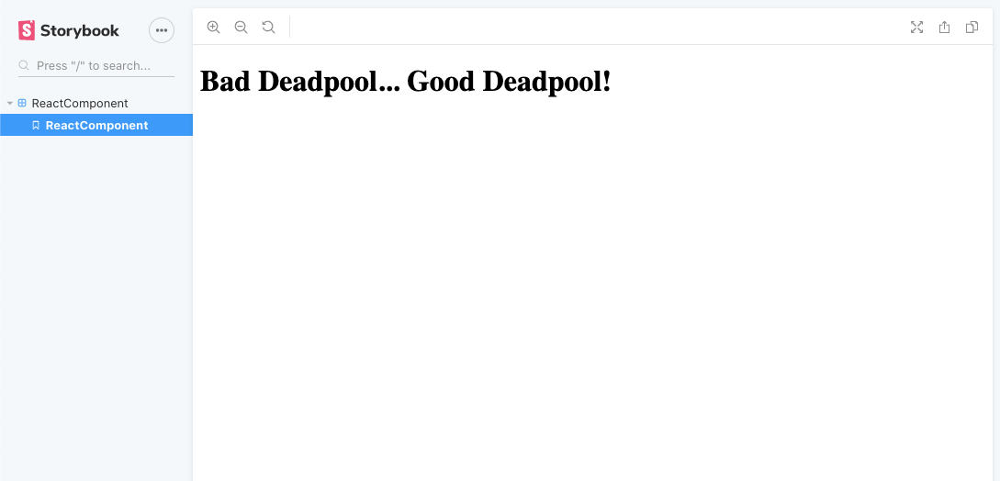

[](https://github.com/WrathChaos/react-library-boilerplate)

[](https://github.com/WrathChaos/react-library-boilerplate)


[](https://opensource.org/licenses/MIT)
[](https://github.com/prettier/prettier)

<p align="center">
  
</p>

# Usage

```sh
git clone git@github.com:WrathChaos/react-library-boilerplate.git my-react-component
```

Simply run the command and clone the project with your component name

### Clean-Up & Simple Run

Clean up the files from the example repository and do not forget to install the dependencies

```sh
rm -rf .git README.md
npm install OR yarn
npm start
```

### Run the component with storyboard

After you've done with your component, simply change these things with your own component name.

#### rollup.config.js

Change the 'ReactComponent' with your component name

```js
input: "src/ReactComponent",
```

#### package.json

Change the 'ReactComponent' with your component name

```js
"main": "lib/ReactComponent.js",
"module": "lib/ReactComponent.es.js",
```

#### index.stories.js

You need to import and write your own example storybook

```js
import { storiesOf } from "@storybook/react";
import React from "react";
import ReactComponent from "../lib/ReactComponent.es";

const ReactComponentContainer = () => (
  <div>
    <ReactComponent title="Bad Deadpool... Good Deadpool!" />
  </div>
);
storiesOf("ReactComponent", module).add("ReactComponent", () => (
  <ReactComponentContainer />
));
```

### How to create/build the my own component?

Simply run the command and it will clean & rollup & preparing the storybook. Simply creating the lib and dist files.
You will serve this lib file on npm or any register.

```sh
    npm run build
```

## What's Included

- Rollup and Babel system for bundling the library in ES5 & ES6
- Awesome testing example tool: **Storybook**
- Prettier, ESLint and Stylelint for code formatting/linting
- SASS support

## Author

FreakyCoder, kurayogun@gmail.com

## License

React Library Boilerplate is available under the MIT license. See the LICENSE file for more info.
