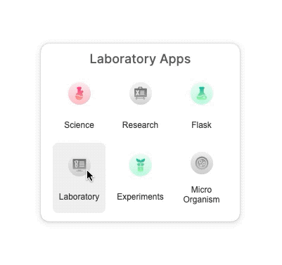

[](https://github.com/WrathChaos/react-app-menu-bar)


[](https://opensource.org/licenses/MIT)
[](https://github.com/prettier/prettier)

<p align="center">
  
</p>

<p align="center">
  
  
</p>

# Install

```sh
npm i @paraboly/react-app-menu-bar
```

# Usage

Please check the storybook's example to get the usage of the library.
You can simply clone the project and `npm i && npm start` to check the how to use the library with alive example.

```js
import AppMenuBar, { AppButton } from "@paraboly/react-app-menu-bar";

<AppMenuBar title="Laboratory Apps">
  <AppButton
    text="Science"
    imageSource={scienceImageSource}
    onPress={() => {}}
  />
  <AppButton
    text="Research"
    imageSource={researchImageSource}
    onPress={() => {}}
  />
  <AppButton text="Flask" imageSource={flaskImageSource} onPress={() => {}} />
  <AppButton
    text="Laboratory"
    imageSource={laboratoryImageSource}
    onPress={() => {}}
  />
  <AppButton
    text="Experiments"
    imageSource={experimentsImageSource}
    onPress={() => {}}
  />
  <AppButton
    text="Micro Organism"
    imageSource={microorganismImageSource}
    onPress={() => {}}
  />
</AppMenuBar>;
```

## Author

FreakyCoder, kurayogun@gmail.com

## License

AppMenuBar is available under the MIT license. See the LICENSE file for more info.
